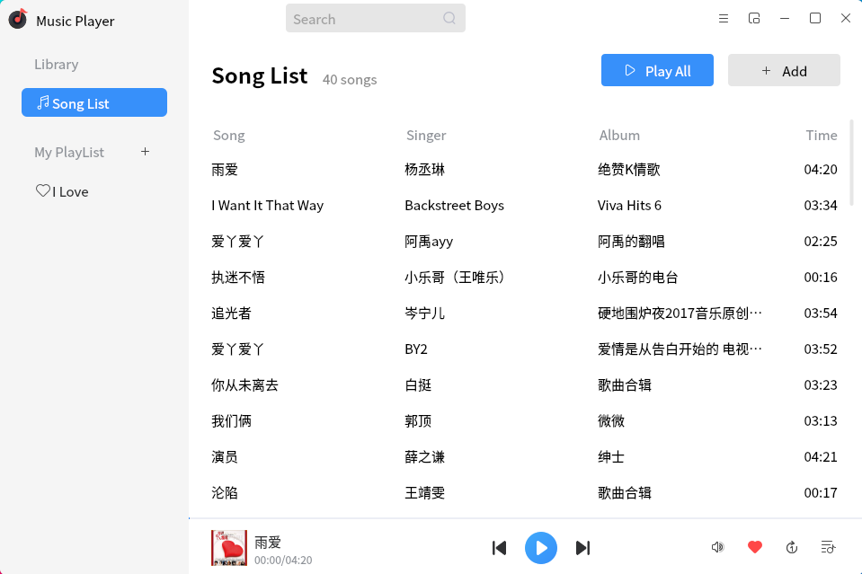
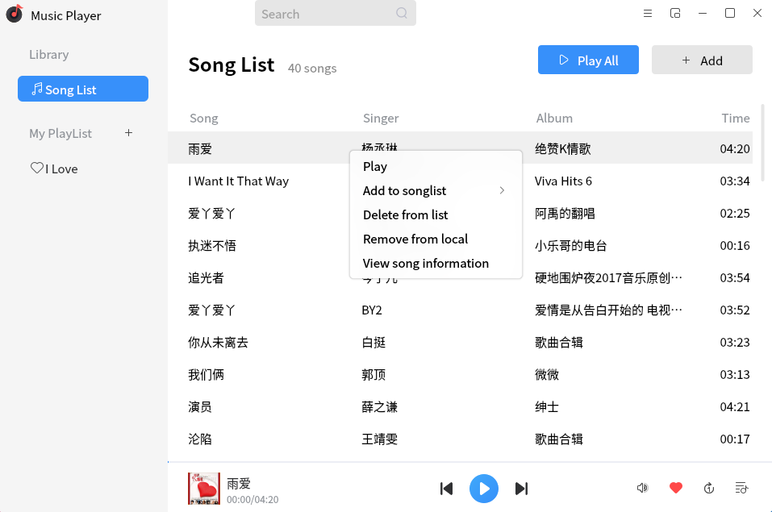
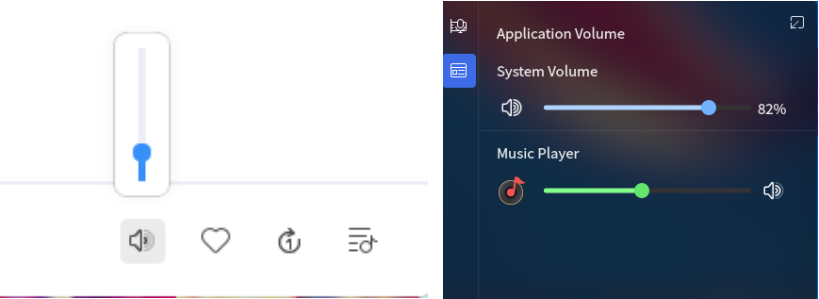
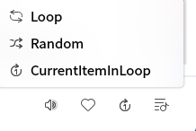
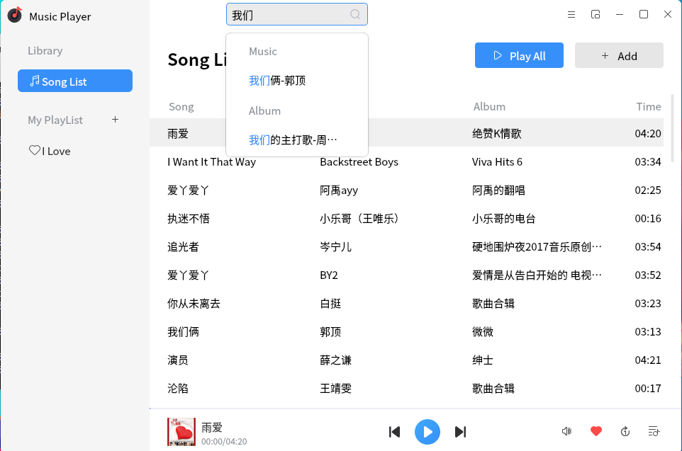

# Music Player
## Overview
 Music Player is a simple to use, user-friendly, support.mp3,.ogg,.wma,.spx,.flac and other music formats music player. While playing local music, you can also group music by custom playlists according to your preferences. In addition to the regular mode, Music Player also has a small window mode to meet the different needs of users.

 

## Songs List page

 

The song list page after adding the songs is shown in the Fig.below.

 

 

### Feature introduction
    You can select the control area for play/pause, previous track, next track and so on.

 

## Right click on the song

 

You can select a song to add to my like, delete, view the song information and other operations.

 

### Feature introduction

 

Select the right button to add to your favorite playlist, delete songs, view song information and other operations.

 

 

## Volume

 

You can control the volume directly in the lower right corner.

 

### Feature introduction

 

Controls the size of music played. Note that the volume key is synchronized with the application volume key under the taskbar. When the volume key control is invalid or the volume key is not applied under the taskbar, it may be caused by the connection failure of the pulseaduido service.

 

 

## Tyle

 

You can select the playback mode of songs, such as Loop, Random and CurrentItemInLoop.

 

 

## Search

 

Click the search box above to quickly search the music we want to play.

 

 

## Toggle mini mode
You can switch the Mini window for better user experience.

 

