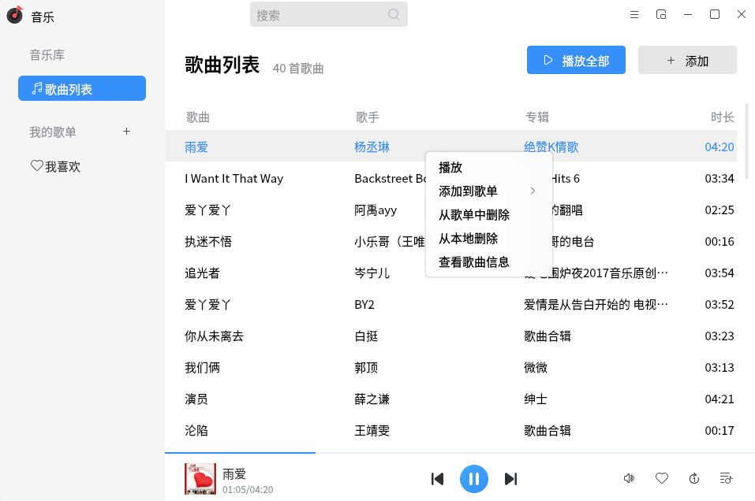

# 音乐
## 概 述
音乐是一款简单易用，界面友好，支持.mp3、.ogg、.wma、.spx、.flac等音乐格式的音乐播放器。在播放本地音乐的同时，还可以根据喜好将自定义歌单来对音乐进行分组。除了常规模式外，音乐还有小窗口模式来满足用户的不同需求。

 

## 歌曲列表页面

 

添加完歌曲后的歌曲列表页面如下图所示。

 

 

### 功能介绍
    您可以选择控制区域进行播放/暂停、上一首、下一首等操作。

 

## 歌曲右键

 

您可以选择一首歌曲进行添加到我喜欢，删除，查看歌曲信息等操作。

 

### 功能介绍

 

选择右键可以进行添加到自己喜欢的歌单、删除歌曲、查看歌曲信息等操作。

 

 

## 音量控制

 

您可以直接在右下角进行音量控制。

 

### 功能介绍

 

控制播放音乐的大小。特别注意的是音量键和任务栏下的应用音量键是同步的。当音量键控制无效或者任务栏下没有应用音量键的时候，可能是因为pulseaduido服务连接失败导致。

 

 

## 模式选择

 

您可以选择歌曲的播放模式，列表循环、随机播放、单曲循环。

 

 

## 切换迷你模式

为了更好的体验您可以切换Mini窗口。

 

