# Video Player
## Summary
Video Player is an audio and video player with beautiful interface and good interactivity. It is developed based on Qt5 and uses MPV as the playback engine. Video Player supports almost all formats of audio and video, and has powerful decoding ability. There are also Mini modes to meet different playback needs.

 

## Home Page

 

The home page function is simple, as shown in the figure below.

 

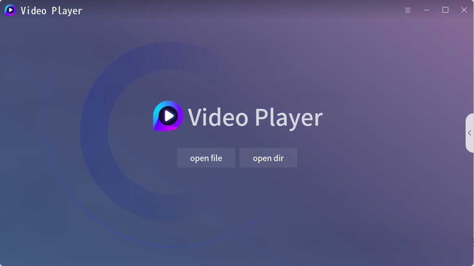

 

The home page has two functions: open file and open folder. In the home page, you can also click the list button on the right to pop up the play list.

 

## Play Page

 

The play page is simple, and only the expand button of the play list is reserved.

 

 

Main functions of play page: click pause play, double-click full screen and cancel full screen, right-click exhale right-click menu, move mouse to exhale title bar and control bar.

 

## Control Bar

 

The control bar is suspended in the playback interface, and translucent style reduces the occlusion of the control bar to the video.

 

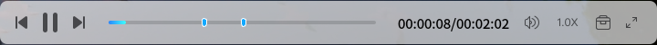

 

Main functions of control bar: Previous Next switch, pause play control, progress control, volume setting, double speed play, screenshot and full screen.

 

## Play List

 

Playlist supports list mode (left) and preview mode (right).

 

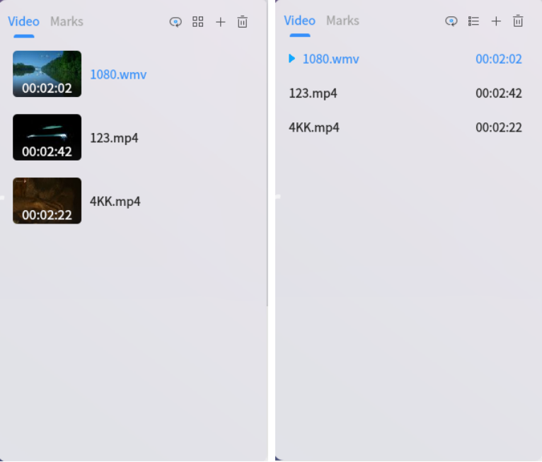

 

Main functions of play list: double click play, single delete, delete invalid files, clear list, play order setting, display mode switching.

 

## Setup

 

The setting interface mainly includes system setting, playback setting, screenshot setting, subtitle setting, audio setting, decoder setting and shortcut key setting.

 

### Sytem

 

System settings support settings: minimize pause, sleep / sleep pause, run multiple instances.

 

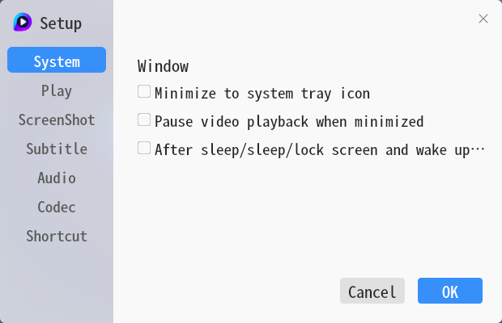

 

### Play

 

Play settings support settings: full screen automatically when playing, clear the play list when exiting, and continue to play from the last stop position.

 

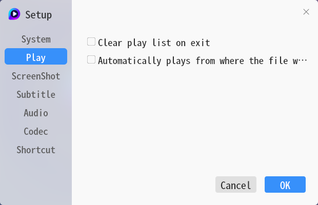

 

### ScreenShot

 

Screenshot settings support settings: screenshot folder, screenshot format.

 

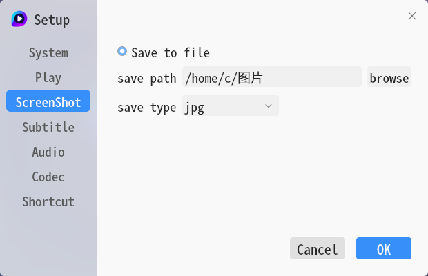

 

### Subtitle

 

Subtitle settings support settings: load subtitles with the same name, load all subtitles under the folder, default folder of subtitles, and font of subtitles.

 

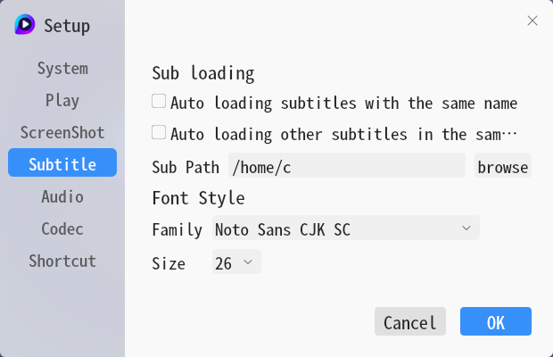

 

### Audio

 

Audio settings support settings: output driver selection.

 

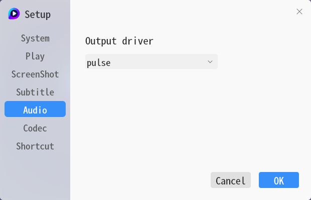

 

### Codec

 

Codec settings support settings: video decoder selection.

 

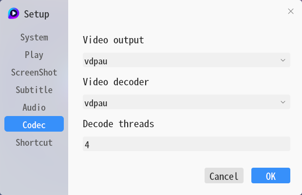

 

### ShortCut Key

 

Shortcut key settings support settings: shortcut key customization.

 

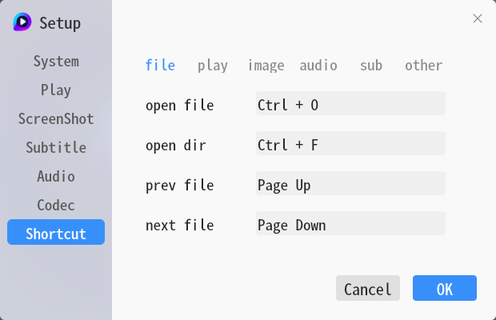

 

## Mini Mode

 

You can switch Mini mode for a better experience.

 

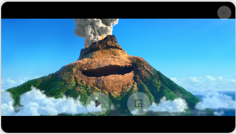

 

