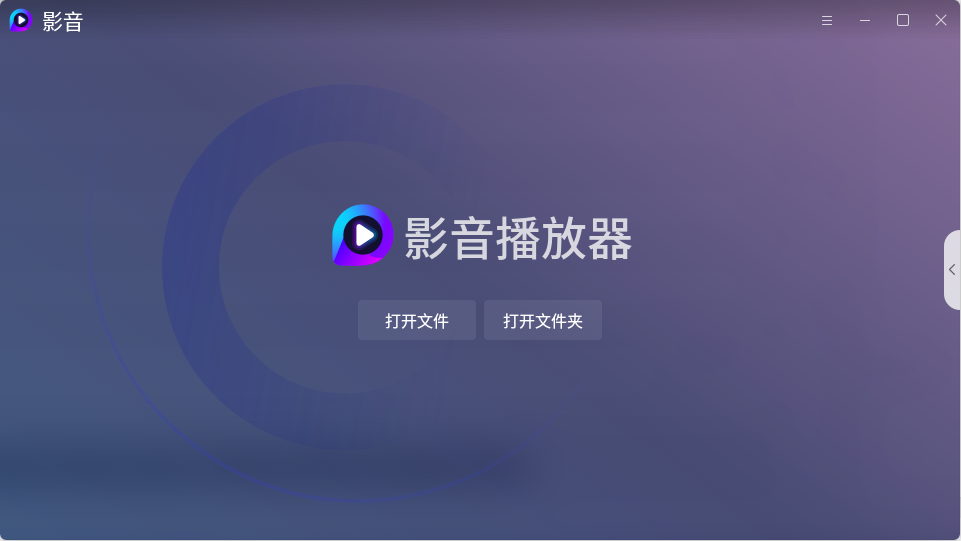
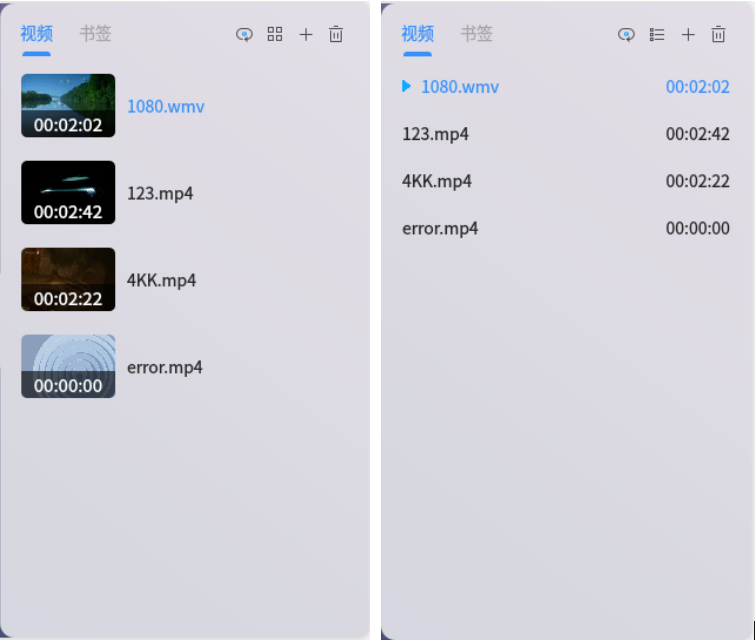
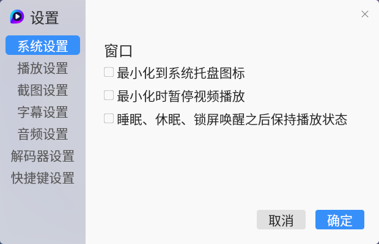
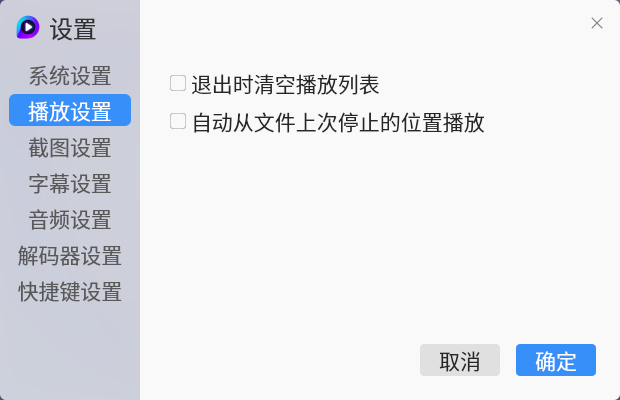
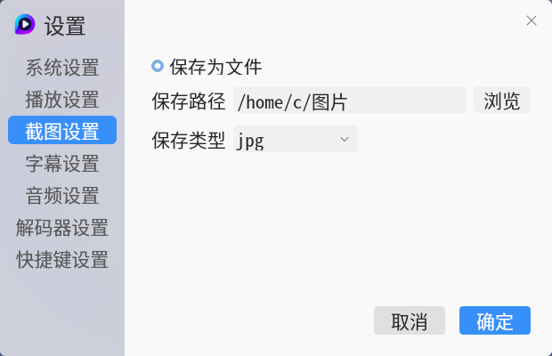
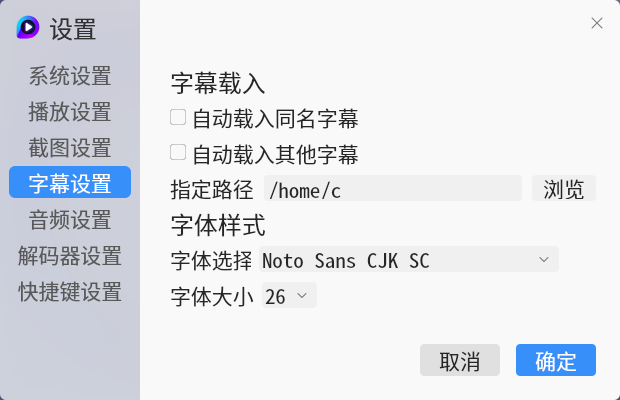
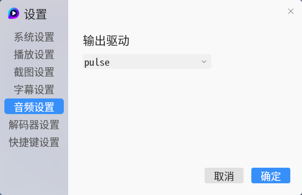
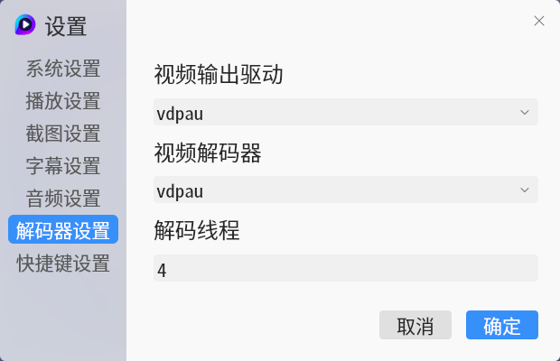
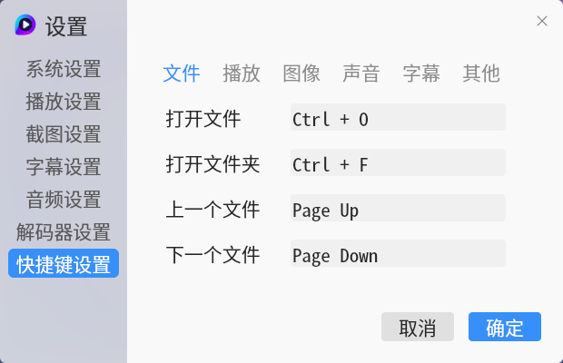
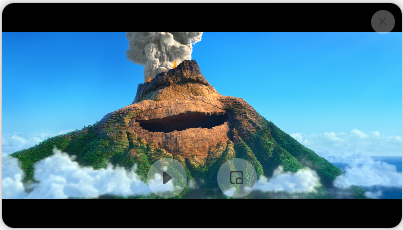

# 影音
## 概 述
影音是一款界面美观，互动性好的一款音视频播放器，它基于qt5开发，使用mpv作为播放引擎。影音支持几乎所有格式的音频和视频，具有强大的解码能力。影音还有迷你模式以满足不同的播放需求。

 

## 主界面

 

主界面功能简洁，如下图所示。

 

 

主界面主要有打开文件和打开文件夹两个功能，在主界面中也可以点击右侧列表按钮弹出播放列表。

 

## 播放界面

 

播放界面简洁，只保留了播放列表展开按钮。

 

 

播放界面主要功能：单击暂停播放，双击全屏和取消全屏，右击呼出右键菜单，鼠标移动呼出标题栏和控制栏。

 

## 控制栏

 

控制栏在播放界面悬浮显示，半透明样式减少控制栏对视频的遮挡。

 

 

控制栏主要功能：上一个下一个切换，暂停播放控制，进度控制，音量设置，倍速播放，截图和全屏。

 

## 播放列表

 

播放列表支持列表模式（左）和预览模式（右）。

 

 

播放列表主要功能：双击播放，单条删除，删除无效文件，清空列表，播放顺序设置，显示模式切换。

 

## 设置

 

设置界面主要包括系统设置，播放设置，截图设置，字幕设置，音频设置，解码器设置和快捷键设置

 

### 系统设置

 

系统设置支持设置项：最小化暂停，休眠/睡眠暂停，运行多个实例。

 

 

### 播放设置

 

播放设置支持设置项：播放时自动全屏，退出时清空播放列表，从上次停止的位置继续播放。

 

 

### 截图设置

 

截图设置支持设置项：截图文件夹，截图格式。

 

 

### 字幕设置

 

字幕设置支持设置项：加载同名字幕，加载文件夹下所有字幕，字幕默认文件夹，字幕字体。

 

 

### 音频设置

 

音频设置支持设置项：输出驱动选择。

 

 

### 解码器设置

 

解码器设置支持设置项：视频解码器选择。

 

 

### 快捷键设置

 

快捷键设置支持设置项：快捷键自定义。

 

 

## 迷你模式

 

为了更好的体验您可以切换为Mini模式。

 

 

